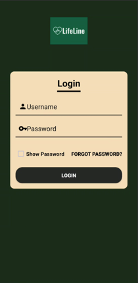
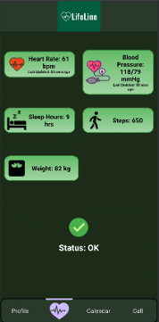
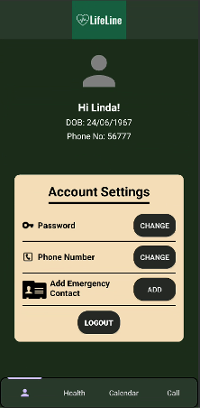
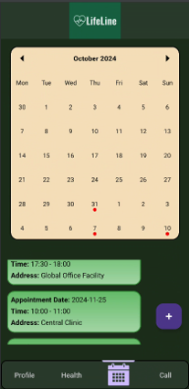

# Elderly Health Monitoring in Smart Homes

## LifeLine

LifeLine is a real-time health monitoring system designed to ensure the safety and well-being of elderly individuals in smart home environments. The app integrates motion sensors and wearable health devices, capturing essential health data and storing it securely in Firebase. In critical situations, LifeLine alerts caregivers and emergency services, providing peace of mind for users and their families.

## Key Features

- **Real-Time Health Monitoring**: Tracks vital signs, movement, and detects emergencies such as falls and abnormal vital signs.
- **Emergency Contact Integration**: One-click call functionality provides elderly users with quick access to emergency contacts.
- **Calendar and Appointment Management**: Built-in calendar feature for scheduling and managing appointments.
- **Account Management**: Allows users to update personal information, add emergency contacts, and manage app settings.

## Technology Stack

- **Programming Language**: Kotlin for application logic, XML for UI design
- **Development Environment**: Android Studio
- **Database**: Firebase Realtime Database
- **Performance Monitoring**: Android Studio Profiler and Firebase Analytics
- **Version Control**: Git and GitHub

## Installation and Setup

### Prerequisites
- Android Studio installed
- Java Development Kit (JDK) version 11

### Steps
1. Clone or download the LifeLine project repository.
2. Open the project in Android Studio.
3. Set the JDK version to 11 by navigating to **File > Project Structure > SDK Location**.
4. Connect an Android device or set up an emulator to run the app.

## Usage

- **GitHub Link**: [GitHub Repository](https://github.com/HazeemHussain/lifelineApp)
- **Firebase Link**: [LifeLine Database](https://lifelineapp-b82fd-default-rtdb.firebaseio.com/)
- **Project Board**: [Trello Board](https://trello.com/invite/b/671992be3a6fc5adb6a5e709/ATTI4f4a6353aabf38470cbfe4e765e0315dBD890AC2/lifeline-app-mobile-systems)

### App Logins

Here are some test accounts for demonstration purposes:

| Username | Password      | DOB         | Phone No       |
|----------|---------------|-------------|----------------|
| linda    | linda123      | 24/06/1967  | 0213456432     |
| Hazeem   | hazeemhussain | 22/07/1971  | 0224532892     |
| Sunny    | sanson12      | 31/10/1964  | 0278654523     |

## Screenshots

### Login Page

### Health Page

### Profile Page

### Calendar View

## Contact Information

For further information or inquiries:

## Contact Information

For further information or inquiries:

  

---

Thank you for exploring LifeLine! We aim to provide a seamless and secure experience for elderly individuals in smart homes.
